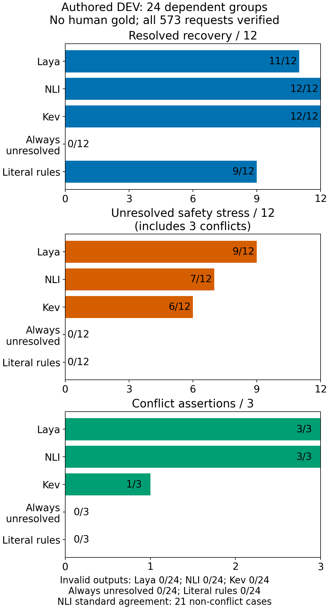
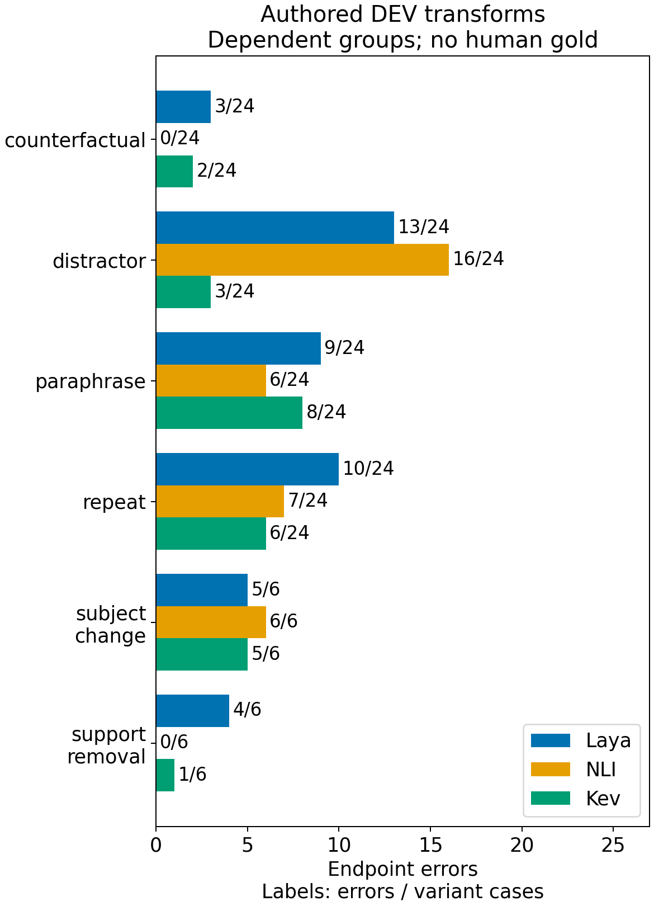

<!-- block: ch03-001 -->

[]{#ch03-001}


<!-- block: ch03-002 -->

[]{#ch03-002}


After the all-survive result, I needed tests small enough to explain. A production-shaped benchmark can tell me that a system fails while leaving too many possible causes entangled. A literal positive, a literal denial and an absent fact ask a simpler question: can this instrument distinguish the relations my application depends on? These controls are not a substitute for realistic evaluation. They help decide what the realistic evaluation should measure.

<!-- block: ch03-003 -->

[]{#ch03-003}


The most consequential distinction was between denial and missing evidence. “The role does not include management” supports a negative observation. “The role maintains the data platform” may simply leave management unspecified. If both become `no`, the backend cannot tell an explicit exclusion from a sparse source. If missing evidence becomes `yes`, the sensor invents a fact. A third outcome such as `not_stated` is useful only if the model actually uses it appropriately.

<!-- block: ch03-004 -->

[]{#ch03-004}


The frozen sparse-alert check exposed this problem directly. Across 149 scorable head-level decisions inside 20 cards, 94 reference fields were `not_stated`. Laya returned `not_stated` correctly on none of those 94. Overall it matched 18 of 149 reference labels. These were diagnostic references, not human-certified truth, and multiple decisions share a card. I therefore treat the counts as strong evidence of a failure on this fixture, not 149 independent trials establishing a population error rate. [Evidence E01](evidence.qmd#e01-workflow-and-sparse-evidence)

<!-- block: ch03-005 -->

[]{#ch03-005}


This result made an attractive shortcut untenable: I could not use schema validity as a proxy for evidence discipline. Every unsupported label could still be a legal enum. Nor could I report only recall on the fields the model asserted. A sensor that answers nearly everything may recover positive cases while flooding the application with invented facts. I need unsupported assertions beside useful supported and denied recall.

<!-- block: ch03-diagram-01 -->

[]{#ch03-diagram-01}


```{mermaid}
%%| fig-responsive: false
%%{init: {"flowchart": {"useMaxWidth": false}}}%%
flowchart TD
    accTitle: Evidence relation separates contradiction from uncertainty
    accDescr: Supplied evidence can support a claim, contradict it, or leave it unresolved. Missing evidence remains distinct from a denial.
    Evidence["Supplied evidence"] --> Relation["Claim relation"]
    Relation --> Support["Supports claim"]
    Relation --> Contradiction["Contradicts claim"]
    Relation --> Unresolved["Leaves claim unresolved"]
```
Diagram: The three relations keep absence of evidence distinct from evidence that denies a claim.

<!-- block: ch03-006 -->

[]{#ch03-006}


I next narrowed the task to whether supplied evidence establishes a claim. Natural-language inference, or NLI, gives a useful vocabulary: support, contradiction and unresolved relation. But I must inspect the actual model interface. A binary entailment score does not automatically distinguish contradiction from absence. Asking both a claim and its negation can help formulate a diagnostic, while also introducing a reconciliation rule whose behavior needs testing.

<!-- block: ch03-007 -->

[]{#ch03-007}


The Laya branch explored factual normalization, atomic heads, neutral option keys and bounded or dual-polarity claim formulations. Simple literal controls improved, but unrelated management and sponsorship evidence still produced errors. I stopped that tested branch from becoming a production route. The historical phrase “zero-shot exhausted” is too broad without this boundary: it means the configurations tried in that branch had not earned admission. It cannot settle every prompt, checkpoint or architecture. [Evidence E01](evidence.qmd#e01-workflow-and-sparse-evidence)

<!-- block: ch03-008 -->

[]{#ch03-008}


A later, separate adapter experiment sharpened the trade-off. Forty configurations produced 1,440 decisions over 36 authored scenarios. No configuration passed its frozen gate, so its confirmation set remained unused. OpenJev's bounded-QA configuration matched 29 of 36 references, but made unsupported assertions on 6 of 12 unresolved cases. Nano-Jev's native groundedness route made none on those 12, while recovering only 3 of 9 support cases and 1 of 9 denial cases. Aggregate agreement concealed the operational difference. [Evidence E02](evidence.qmd#e02-adapter-study)

<!-- block: ch03-009 -->

[]{#ch03-009}


I do not interpret zero observed unsupported assertions as zero risk. The sample is small, authored and task-specific. I also cannot reward a component merely for declining everything: native abstention, a valid semantic `unresolved` answer and a broken response are distinct events. The constant-unresolved baseline is useful precisely because it makes the no-information strategy visible.

<!-- block: ch03-diagram-02 -->

[]{#ch03-diagram-02}


```{mermaid}
%%| fig-responsive: false
%%{init: {"flowchart": {"useMaxWidth": false}}}%%
flowchart TD
    accTitle: Evaluation separates response validity from useful coverage
    accDescr: An output may be malformed or valid. Valid responses can assert a label that may still be wrong, abstain, or return a semantic unresolved label; a constant-unresolved baseline exposes a no-information strategy.
    Output["Model output"] -->|"malformed"| Broken["Invalid response"]
    Output -->|"valid"| Valid["Valid response"]
    Valid --> Answer["Asserted label may be wrong"]
    Valid --> Abstain["Native abstention"]
    Valid --> Unresolved["Semantic unresolved"]
```
Diagram: Separating malformed, abstaining and unresolved outcomes prevents schema failure or universal non-answering from counting as useful semantic coverage.

<!-- block: ch03-010 -->

[]{#ch03-010}


The experiment had reached a useful stopping point even without a winner. It showed why ordinary accuracy was the wrong selection rule and which failures needed a better instrument. [Chapter 4](04-landscape.qmd) broadens the search by native task, while the prompt branch continues in parallel.

<!-- block: ch03-011 -->

[]{#ch03-011}


## 2026-10-02: Repeatability without reliability

I next held the question small: three attributes, 24 authored development scenarios, six supported facts, six denials and twelve unresolved cases. Three unresolved cases contain conflicting evidence. Laya recovered 11/12 explicit facts; DeBERTa NLI and Kev recovered 12/12. Their unsupported assertions were nevertheless 9/12, 7/12 and 6/12. A frozen literal baseline recovered 9/12 facts with no unsupported assertions and 21/24 overall agreement. Its conservative quote/apostrophe guard limits what that comparison establishes. [Evidence E09](evidence.qmd#e09-bounded-native-robustness)



Each canonical lane then received 108 transformed requests from those same 24 groups. Exact repetition changed zero labels out of 24 for every lane, while preserving ten Laya errors, seven NLI errors and six Kev errors. Repeatability here means the same immediate answer, including the same mistake; it establishes neither correctness nor long-term stability.

<!-- block: ch03-diagram-03 -->

[]{#ch03-diagram-03}


```{mermaid}
%%| fig-responsive: false
%%{init: {"flowchart": {"useMaxWidth": false}}}%%
flowchart TD
    accTitle: Repeating an answer does not validate its evidence
    accDescr: A repeated request can return the same label, which may be correct or preserve an original error. Separate evidence changes probe whether the answer follows the right source and subject.
    Request["Repeat request"] --> Same["Same label"]
    Same --> Correct["Correct answer retained"]
    Same --> Error["Original error retained"]
    Edit["Change evidence or subject"] --> Scope["Test evidence attribution"]
```
Diagram: A stability check and an attribution check answer different questions.

<!-- block: ch03-012 -->

[]{#ch03-012}


DeBERTa reached the correct destination on all 24 complete counterfactual evidence edits, but only 17/24 pairs had both a correct source and destination. It also returned unresolved after all six support removals. Those are useful observations, not a minimal-negation causal test: complete evidence replacements change more than a single logical operator.

Attribution remained fragile. Subject changes produced errors on 6/6 NLI cases and 5/6 for each other lane. Distractors produced 16/24 NLI errors versus 3/24 for Kev. Removing support produced 4/6 Laya errors and 1/6 Kev errors. The architectures already perform useful language operations, but this fixture exposes failures in whose evidence counts and which evidence is irrelevant. It does not prove a bag-of-words mechanism or a capacity limit.


