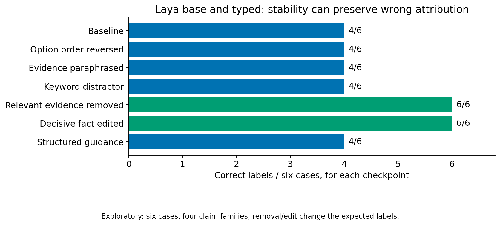

<!-- block: ch05-001 -->

[]{#ch05-001}

<!-- block: ch05-002 -->

[]{#ch05-002}

I did not want dataset preparation to become an implicit decision to train. Another branch kept the checkpoint fixed and changed the request. This tests a different hypothesis: perhaps the model already has a useful distinction, but my interface fails to expose it. The branch can succeed on one task and fail on another. A blanket verdict about “prompt engineering” would erase that information.

<!-- block: ch05-003 -->

[]{#ch05-003}

The first controlled probe used six fictional cases, two checkpoints and eleven conditions: 132 decisions. Meaning-preserving changes included reordering, paraphrasing and adding irrelevant material. Evidence removal and decisive edits deliberately changed what the answer should be. These need opposite expectations: a good instrument should be stable under irrelevant changes and responsive to changes that alter support. [Evidence E04](evidence.qmd#e04-prompt-controls)

<!-- block: ch05-004 -->

[]{#ch05-004}

Both checkpoints were stable across the tested paraphrases and distractors, but each began with only four correct labels out of six. The persistent error was attribution. Evidence that Tomas owns a silver key does not deny that Mira owns a copper key. It leaves that claim unresolved. Both models answered denial, and explicit guidance did not fix it. Removing decisive evidence and making decisive edits worked on the simple controls. Stability and correctness had separated in a particularly useful way.

<!-- block: ch05-005 -->

[]{#ch05-005}

<!-- block: ch05-006 -->

[]{#ch05-006}

Figure: exploratory paired counts from six fixtures and four underlying claim families, not 132 independent examples. The transformations have different reference labels where meaning changes. This is a behavioral diagnostic, not a population accuracy estimate. See E04 for reference provenance and limitations.

<!-- block: ch05-007 -->

[]{#ch05-007}

A second probe used patterns from the public typed-decision training corpus to design fresh examples. Only TRAIN material was inspected; existing validation and test rows were not used. The current corpus revision was not independently linked to the exact cached training run. Its teacher labels were also not human truth. I used the corpus to form hypotheses about request structure, then evaluated newly authored inputs. [Published corpus](https://huggingface.co/datasets/LocalLLaMA/typed-decisions), [Evidence E05](evidence.qmd#e05-corpus-informed-probes)

<!-- block: ch05-008 -->

[]{#ch05-008}

The 186 predictions comprised 156 main predictions and thirty tier-control predictions. Rewording an invoice reconciliation question moved base Laya from two correct cases out of four to four out of four. For typed Laya, meaningful invoice, order and delivery keys preserved four out of four; replacing them with generic field names reduced the result to two. Flattened prose retaining the semantic paths also achieved four. The evidence concerns semantic role information, not a demonstrated preference for JSON syntax.

<!-- block: ch05-009 -->

[]{#ch05-009}

Duplicate detection remained constant: base said yes to all four cases, typed said no to all four. Each matched two references but failed a different class. The published corpus's negative-label imbalance was consistent with one possible explanation for typed behavior; it did not establish the cause. An exact comparator could solve these intentionally simple invoice cases. The experiment gave me a reason to preserve deterministic code, alongside a task-specific clue about wording.

<!-- block: ch05-010 -->

[]{#ch05-010}

These fixtures were tiny and included near-replicates. The next study therefore prepared 150 scenarios across three tasks, split into ninety development and sixty confirmation cases. Four conditions are fixed in advance; candidate selection occurs on development, with baseline and the selected condition reserved for confirmation. At this book's cutoff, the record is development-ready and reports no inference outcomes. I cannot supply a winning prompt or a confirmed gain. [Evidence E06](evidence.qmd#e06-expanded-study-status)

<!-- block: ch05-011 -->

[]{#ch05-011}

The discipline matters more than a favorable ending. Once I inspect an error and design a repair, that example becomes development evidence. Its paraphrases must stay in the same split. A larger count of related variants does not manufacture independent confirmation. These questions lead directly to the next branch: [what should the reference answer mean?](06-references.qmd)
