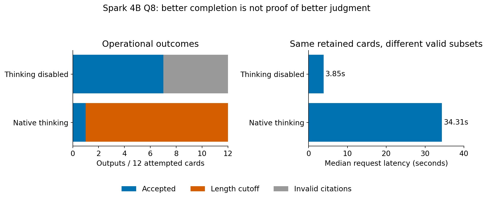
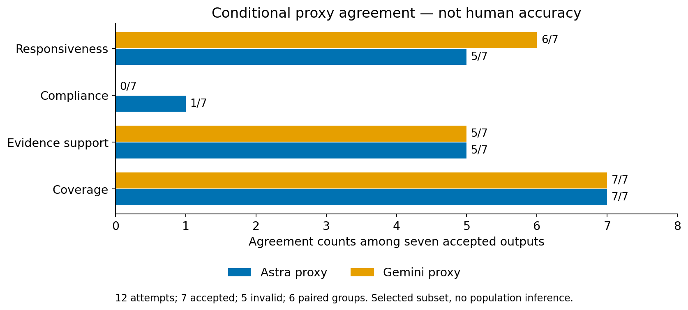

<!-- block: ch07-001 -->

[]{#ch07-001}


<!-- block: ch07-002 -->

[]{#ch07-002}


The local-judge question was economic and empirical: could Spark supply useful annotations while reducing routine frontier-model calls? Loading weights would answer only a preliminary question. I needed complete outputs, valid provenance and acceptable judgments, and I needed to count the work required to review failures. Local inference is not automatically free or cheaper end to end.

<!-- block: ch07-003 -->

[]{#ch07-003}


The pilot used the official Spark-X2.5-4B Q8_0 artifact through an isolated llama.cpp runtime on an RTX 3060. The configuration allowed one request at a time, a 4,096-token context and a 2,048-token completion cap. Observed GPU allocation was around 4.5 GiB; polling did not establish a continuous peak. This was a generative annotation route, not Spark's separate bounded-option harness. [Official Spark repository](https://github.com/XHToken/Spark-X2.5), [Evidence E07](evidence.qmd#e07-spark-pilot)

<!-- block: ch07-004 -->

[]{#ch07-004}


Native thinking produced one accepted output from twelve attempts. Eleven reached the completion limit without final labels. Those failures consumed time but did not provide eleven semantic decisions to score. The rendered prompts plus completions remained below the context limit, so enlarging context alone would not explain or repair the observed output-budget failure.

<!-- block: ch07-005 -->

[]{#ch07-005}


Disabling thinking through the native template preserved the task and rubric. Seven of twelve outputs then passed strict validation. The other five finished with valid JSON but invalid evidence identifiers. Median latency fell from 34.31 seconds to 3.85 seconds. That is a useful operational improvement on these requests. It does not show semantic superiority because the accepted subsets differ, and repaired citations were not admitted as valid benchmark outputs.

<!-- block: ch07-006 -->

[]{#ch07-006}




<!-- block: ch07-007 -->

[]{#ch07-007}


Figure: twelve attempts per mode on the same twelve cards, representing six paired groups. Accepted-output coverage and latency describe this pilot. Budget-exhausted and citation-invalid outputs remain separate failures; these bars do not measure human accuracy.

<!-- block: ch07-008 -->

[]{#ch07-008}


Among the seven accepted nonthinking outputs, coverage agreed with both proxies on all seven and evidence support on five. Compliance agreed on one against Astra and none against Gemini; responsiveness agreed on five and six respectively. The denominator seven is appropriate for that conditional semantic comparison. The denominator twelve remains necessary for pipeline success and cost. Selecting valid outputs does not make them representative of the failures excluded.

<!-- block: ch07-009 -->

[]{#ch07-009}




<!-- block: ch07-010 -->

[]{#ch07-010}


Figure: proxy agreement on the selected valid seven of twelve outputs, not accuracy on twelve attempts. Reference disagreement remains visible. With only six underlying paired groups, these descriptive counts cannot establish deployment reliability.

<!-- block: ch07-011 -->

[]{#ch07-011}


Inspection of all 24 outputs across the two modes exposed a narrower hypothesis than “the model is too small.” Eight of the twelve nonthinking compliance rationales assessed the judge's own annotation format instead of the target answer. Five were accepted outputs; three were citation-invalid and inspected only for diagnosis. Other judgments confused omitted requested information with unsupported assertions. I can describe these observable errors without claiming to know their internal mechanism.

<!-- block: ch07-012 -->

[]{#ch07-012}


The next inexpensive tests would isolate the target answer, ask atomic dimension questions and separate bounded labels from optional citations. Structured decoding might prevent some shape errors, but cannot establish that the judgment concerns the right text. None of these semantic interventions has been demonstrated here. The larger 108-card Spark job benchmark did not run, and the owned server was stopped after preserving the pilot evidence.

<!-- block: ch07-013 -->

[]{#ch07-013}


Spark made the cost question more concrete. Faster completion can reduce one expense while invalid provenance and mistaken targets increase review. The useful comparison is cost per sufficiently reliable, accepted annotation, with failed calls included. [Chapter 8](08-supervision.qmd) explains why preserving those failures creates a better candidate corpus than keeping only the successful labels.

<!-- block: ch07-diagram-01 -->

[]{#ch07-diagram-01}


```{mermaid}
%%| fig-responsive: false
%%{init: {"flowchart": {"useMaxWidth": false}}}%%
flowchart TD
accTitle: Spark pilot outcomes by mode
accDescr: Twelve attempts in each mode yielded one accepted thinking output with eleven budget failures, and seven accepted nonthinking outputs with five citation-invalid outputs.
    A["Same task and rubric"] --> B["Thinking"]
    B --> C["1 accepted of 12"]
    B --> D["11 budget failures"]
    A --> E["Nonthinking"]
    E --> F["7 accepted of 12"]
    E --> G["5 citation-invalid"]
```
Diagram: This records pipeline outcomes by mode; semantic agreement was computed only on the selected valid nonthinking outputs.
